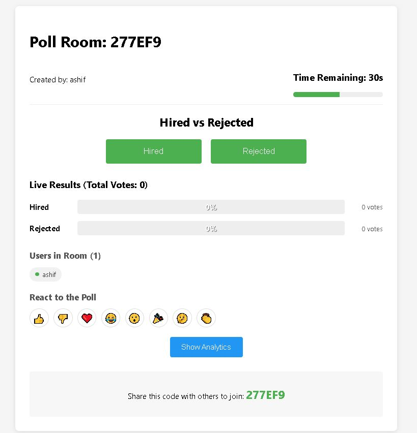
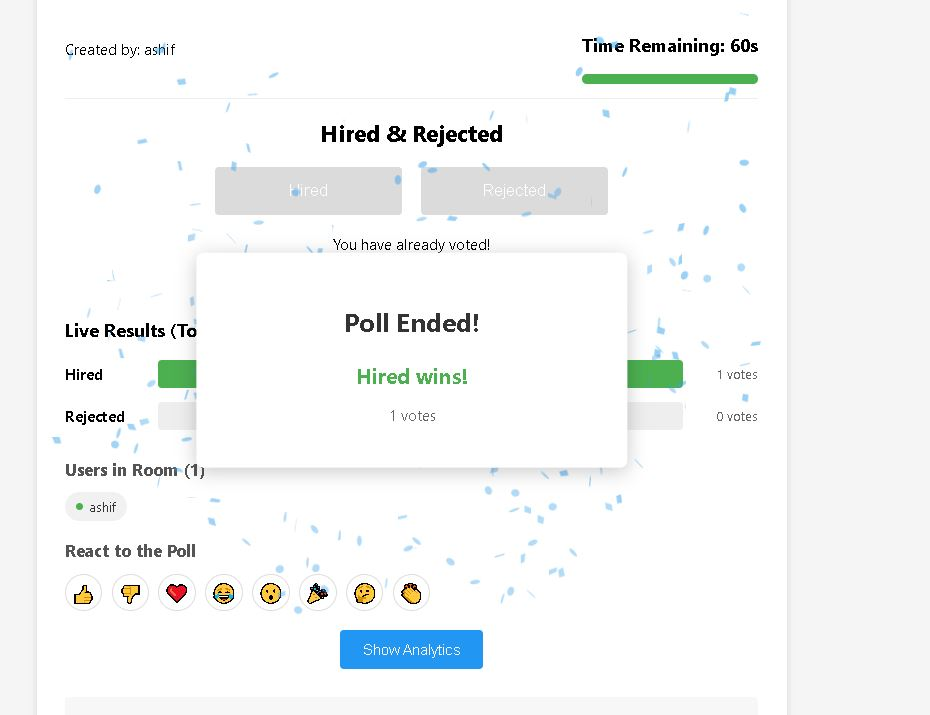

# Live Poll Battle

A real-time polling application that allows users to create or join poll rooms and vote live with instant result updates across all participants.

[

## 📸 Demo Previews

### Preview 1

### Preview 2

### Result

## Features

### Core Features
- **Real-time Polling**: Create and join poll rooms with live voting
- **Instant Results**: See vote counts update in real-time as users vote
- **User Authentication**: Simple username-based identification (no password required)
- **Room Management**: Create rooms with unique codes that others can join
- **Vote Protection**: Prevent users from voting multiple times
- **Timer System**: Automatic 60-second countdown for each poll, after which voting is disabled
- **Persistence**: User votes are saved in local storage and persist across page refreshes

### Enhanced Features
- **Real-time Analytics Dashboard**: Advanced visualizations for poll creators including:
  - Vote distribution charts
  - Participation statistics
  - Vote trend analysis over time
  - User engagement metrics
- **User Presence System**: See who's currently in the room and their voting status
- **Interactive Emoji Reactions**: Express reactions to the poll with animated emojis
- **Winner Celebration**: Visual confetti celebration when the poll ends, highlighting the winning option
- **Responsive Design**: Works on both desktop and mobile devices

## Setup Instructions

### Prerequisites
- Node.js (v14 or higher)
- npm (comes with Node.js)

### Server Setup
1. Clone this repository:
git clone https://github.com/Asif12as/Live_Poll_Battle.git
cd live-poll-battle

2. Install server dependencies:
cd server
npm install

3. Start the server:
npm run dev

The server will run on http://localhost:5000.

### Client Setup
1. Open a new terminal window and navigate to the client directory:
cd ../client

2. Install client dependencies:
npm install

3. Start the client:
npm start

The client will run on http://localhost:3000 and should automatically open in your browser.

## How It Works

### Technical Architecture

This application uses a client-server architecture with WebSockets for real-time communication:

- **Frontend**: React.js for the UI, Socket.io client for real-time communication
- **Backend**: Node.js with Express, Socket.io for WebSocket connections

### Vote State Sharing and Room Management

The application implements a real-time state synchronization approach:

1. **Room Management**:
   - Rooms are stored in an in-memory object on the server
   - Each room has a unique ID (6-character alphanumeric code)
   - Rooms store information about the poll question, options, users, and voting status
   - When a room is created, a timer starts that will automatically close voting after 60 seconds

2. **Vote State Sharing**:
   - When a user votes, the vote is sent to the server via WebSocket
   - The server updates the room's vote count and marks the user as having voted
   - The server then broadcasts the updated vote state to all connected users in that room
   - All clients receive the update and re-render their UI to show the current results
   - Votes are also stored in the user's browser localStorage to prevent re-voting if they refresh

3. **Real-time Updates**:
   - Socket.io enables bidirectional, event-based communication
   - The server broadcasts events for votes, timer updates, user joining/leaving, and reactions
   - Clients listen for these events and update their local state accordingly
   - The React UI re-renders automatically when the state changes

This architecture allows for a seamless real-time experience where all users see the same poll state at the same time, without requiring any manual refresh.

## Technologies Used

### Frontend
- React.js
- React Router
- Socket.io Client
- Chart.js (for analytics)
- Canvas Confetti (for celebrations)

### Backend
- Node.js
- Express
- Socket.io
- UUID (for generating unique room codes)

## License

MIT

## Author

Md Ashif
